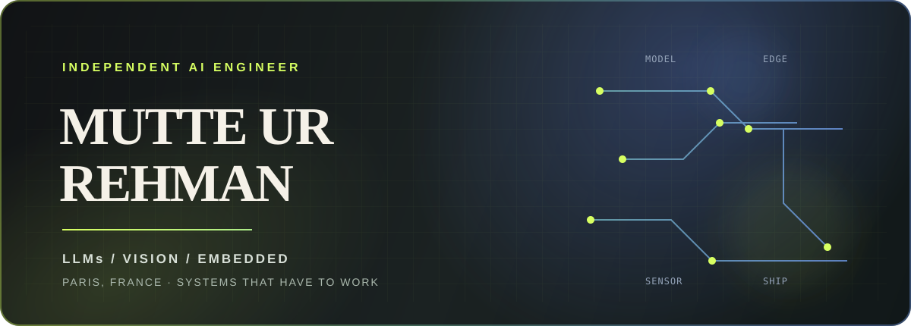

 

  

[Website](https://muttequrashi.github.io) &nbsp; · &nbsp; [LinkedIn](https://linkedin.com/in/mutte-ur-rahman) &nbsp; · &nbsp; [Email](mailto:mutte.rehman@gmail.com)

 

> I build AI systems that have to work outside the notebook.
>
> Language models, computer vision, sensors, firmware, and the unglamorous engineering that connects them.

 

<table>
<tr>
<td width="58%" valign="top">

## The short version

I am an independent AI engineer with 7+ years of production experience. Most of my work lives at the boundary between software and the physical world: cameras on factory floors, models running on edge devices, and embedded systems that still need to behave when the network disappears.

I also build reliable LLM products: retrieval systems, agent workflows, evaluation harnesses, and approval paths that make model behaviour easier to understand and improve.

</td>
<td width="42%" valign="top">

## Right now

**Thinking about** 
How to make AI systems observable, economical, and useful after launch.

**Usually working in** 
Python · C++ · PyTorch · Rust

**Based in** 
Paris, France

</td>
</tr>
</table>

 

## Three parts of the same job

<table>
<tr>
<td width="33%" valign="top">

### 01 · Intelligence

LLM applications, RAG, agents, tool use, evals, and guardrails.

The goal is not a clever demo. It is a system with behaviour you can inspect and improve.

</td>
<td width="33%" valign="top">

### 02 · Perception

Computer vision for cameras that are moving, crowded, badly lit, or far from a data centre.

Detection, tracking, calibration, and inference on Jetson and other constrained hardware.

</td>
<td width="33%" valign="top">

### 03 · Integration

Firmware, sensors, PCBs, control loops, telemetry, and cloud services.

The part where the diagram becomes a real product.

</td>
</tr>
</table>

 

## Selected work

Some engagements are private. These are the useful details I can share without turning a client project into marketing copy.

| | Problem | My part |
| :--- | :--- | :--- |
| **01** | Warehouse cameras needed to understand pallets in real time | Built an edge detection and tracking pipeline running at 30+ FPS on Jetson. [View the public repository](https://github.com/muttequrashi/pallet-detection-edge) |
| **02** | Industrial safety systems needed more than a single camera | Designed multi-camera vision pipelines for PPE and zone intrusion detection across 4+ concurrent streams. |
| **03** | A hydrogen VTOL platform needed dependable sensing and actuation | Designed custom electronics, PX4 drivers, sensor integration, and test-bench systems. |
| **04** | LLM products needed grounding, control, and measurable quality | Built agent workflows, hybrid retrieval, citation grounding, evals, and approval gates. |

 

## Public projects

Small, honest pieces of work that are safe to inspect.

<table>
<tr>
<td width="50%" valign="top">

### [pallet-detection-edge](https://github.com/muttequrashi/pallet-detection-edge)

Pallet detection and tracking for overhead warehouse cameras. Jetson, TensorRT, YOLO, Python.

`Apache-2.0`

</td>
<td width="50%" valign="top">

### [turbovec](https://github.com/muttequrashi/turbovec)

Rust vector indexing with Python bindings, built around TurboQuant.

`Rust` `Python`

</td>
</tr>
<tr>
<td width="50%" valign="top">

### [Autonomous Driving TurtleBot3](https://github.com/muttequrashi/Autonomous-Driving-Turtlebot3)

Lane detection and autonomous navigation for a mobile robot.

`Python` `ROS`

</td>
<td width="50%" valign="top">

### [stereo-vo-tum-vi](https://github.com/muttequrashi/stereo-vo-tum-vi)

Stereo visual odometry experiments for perception and robotics.

`Computer vision`

</td>
</tr>
</table>

[Browse all public repositories →](https://github.com/muttequrashi?tab=repositories)

 

## My working rule

<table>
<tr>
<td width="20%" valign="top"><strong>Frame</strong>  Find the constraint that actually matters.</td>
<td width="20%" valign="top"><strong>Prove</strong>  Test the difficult part before polishing the demo.</td>
<td width="20%" valign="top"><strong>Measure</strong>  Watch latency, quality, cost, and failure modes.</td>
<td width="20%" valign="top"><strong>Connect</strong>  Join the model to the hardware and the people around it.</td>
<td width="20%" valign="top"><strong>Leave it running</strong>  Document it well enough for someone else to operate.</td>
</tr>
</table>

> The question after the demo is always the same: **will this survive production?**

 

## Tools I reach for

 

## A few receipts

**MSc Computer Vision and Robotics** · VIBOT, Université de Bourgogne 
**BE Mechatronics Engineering** · Air University, Islamabad 
**IEEE publication** · [Self-tuned PID control for quadcopters](https://doi.org/10.1109/CEET1.2019.8711864)

 

## Have a real system to figure out?

Tell me what you are building, where it is getting stuck, and what “working” needs to mean.

 

  

Independent by choice. Practical by default. Close to the real system.

